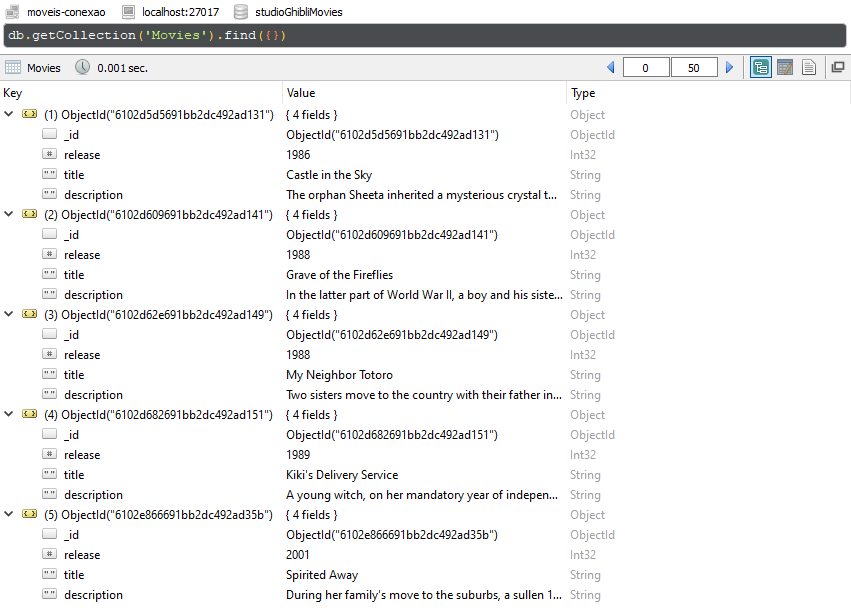
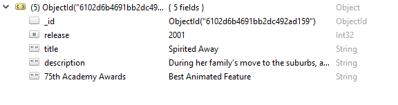
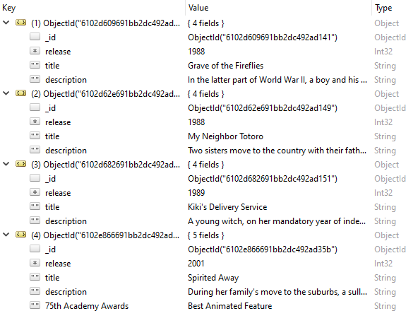
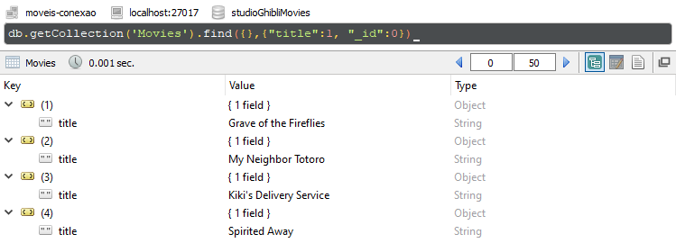
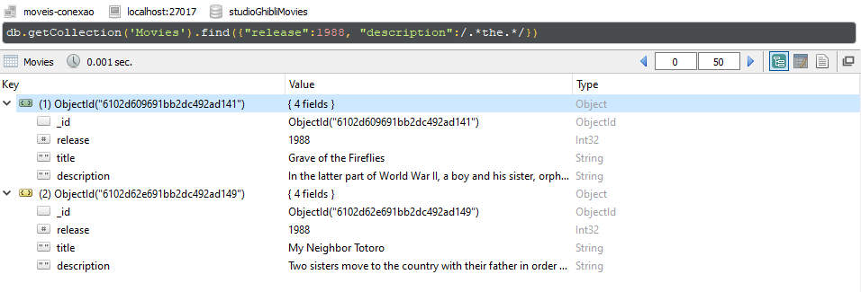
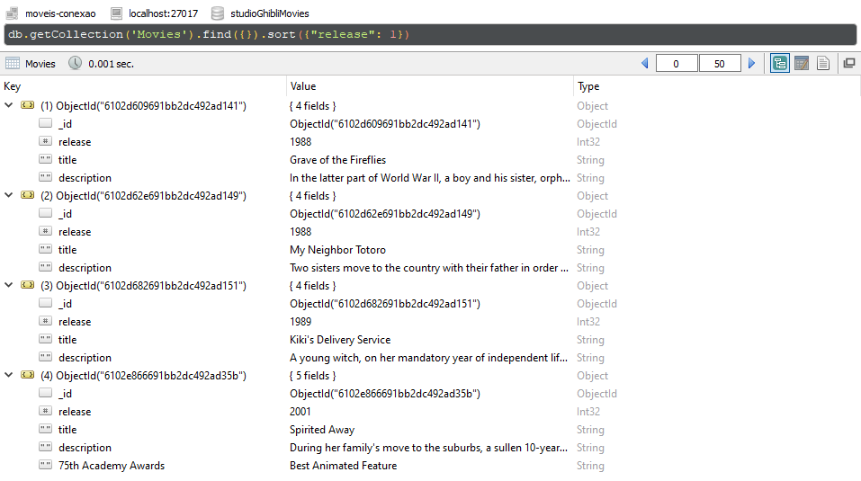
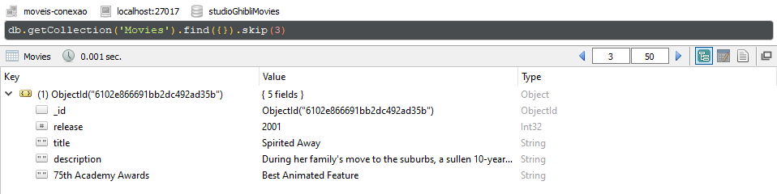

<h2 align="center"> 
<br> 
<p align="center">Semana 12 - Introdução ao Banco de Dados<p>
</h2>
<p align="center"> Este database é para pessoas que assim como eu, amam o Studio Ghibli.<br> E nada melhor que reunir alguns dos maiores sucessos de bilheteria para serem armazenados no banco de dados.<p>
  
> O que temos desses dados?
  
``` json
    {
      "release":1986,
      "title": "Castle in the Sky",
      "description": "The orphan Sheeta inherited a mysterious crystal that links her to the mythical sky-kingdom of Laputa. With the help of resourceful Pazu and a rollicking band of sky pirates, she makes her way to the ruins of the once-great civilization. Sheeta and Pazu must outwit the evil Muska, who plans to use Laputa's science to make himself ruler of the world."
    },
    {
      "release":1988,
      "title": "Grave of the Fireflies",
      "description": "In the latter part of World War II, a boy and his sister, orphaned when their mother is killed in the firebombing of Tokyo, are left to survive on their own in what remains of civilian life in Japan. The plot follows this boy and his sister as they do their best to survive in the Japanese countryside, battling hunger, prejudice, and pride in their own quiet, personal battle."
    },
    {
      "release":1988,
      "title": "My Neighbor Totoro",
      "description": "Two sisters move to the country with their father in order to be closer to their hospitalized mother, and discover the surrounding trees are inhabited by Totoros, magical spirits of the forest. When the youngest runs away from home, the older sister seeks help from the spirits to find her."
    },
    {
      "release":1989,
      "title": "Kiki's Delivery Service",
      "description": "A young witch, on her mandatory year of independent life, finds fitting into a new community difficult while she supports herself by running an air courier service."
    },
    {
      "release":2001,
      "title": "Spirited Away",
      "description": "During her family's move to the suburbs, a sullen 10-year-old girl wanders into a world ruled by gods, witches, and spirits, and where humans are changed into beasts."
   }
```
> Passo a passo:

- Inicializar o servidor no prompt de comando;
- Utilizar o mongodb;
- Criar um novo database com o nome de: `` studioGhibliMovies ``;
- Criar uma coleção chamada: `` Movies ``;
- Estabelecer uma conexão local com Robo 3T;
- Inserir documentos na coleção `` Movies ``.

> E assim ficou o documento de filmes do Studio ghibli:
  
  
> Para que a base de dados seja ainda mais completa, foi adicionado ao filme ``"Spirited Away"`` a informação: ``"75th Academy Awards": "Best Animated Feature"``

```` json
  db.getCollection('Movies').update(
  {"title": "Spirited Away"},
  { $set:
       {
           "75th Academy Awards": "Best Animated Feature"
        }
  }
);
  
````
  

> Para movimentar o banco de dados, houve a remoção por título do filme ``"Castle in the Sky"``.
 ```` json
  db.getCollection('Movies').remove({ 'title' : 'Castle in the Sky' })
  
 ````
> E assim ficou o documento de filmes atualizado:
  


##
  
<h3 align="center"> 
<p align="center">Consultas no MongoDB<p>
</h3>

##

- Consulta com projeção: 

```` json
db.getCollection('Movies').find({},{"title":1, "_id":0})
````
> Mostra apenas os títulos de cada filme: 



- Consulta utilizando combinação entre os seletores: 

```` json
db.getCollection('Movies').find({"release":1988, "description":/.*the.*/})
````
> Mostra apenas os filmes com lançamento em ``1988`` e que contenham o determinante ``the``:



- Consulta paginada e ordenada pelo método ``sort()``: 

```` json
db.getCollection('Movies').find({}).sort({"release": 1})
````
> Ordena filmes pela data de lançamento:



- Consulta paginada e ordenada pelo método ``skip()``: 
```` json
db.getCollection('Movies').find({}).skip(3)
````
> Pula três vezes o resultado da consulta:



##
<h4 align="center"> 
  <br>  
  <p align="center">Esperem novas atualizações e aguardem o serviço de entregas da Kikki!
</h4>

##

#### Connect with me:
<div>
  <a href="https://www.linkedin.com/in/dannyeli-silva-47152115b/" target="_blank"></a>
  <a href="https://www.instagram.com/dannyelic/?hl=pt-br" target="_blank"></a>
</div>
